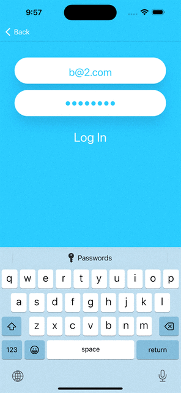

	

# Flash-Chat

## Goal

IOS messaging app with the registered users you can send messages in a group. Include: Table View, Navigation Controller, custom cell with xib file, and working with 3rd party libraries.
Firebase for storing the messages by making our own cloud-based backend database.

## What you will learn

* How to integrate third party libraries in your app using Cocoapods and Swift Package Manager.
* How to store data in the cloud using Firebase Firestore.
* How to query and sort the Firebase database.
* How to use Firebase for user authentication, registration and login.
* How to work with UITableViews and how to set their data sources and delegates.
* How to create custom views using .xib files to modify native design components.
* How to embed View Controllers in a Navigation Controller and understand the navigation stack.
* How to create direct Segues for navigation.

## This project is created with the help of resources provided by AppBrewery
